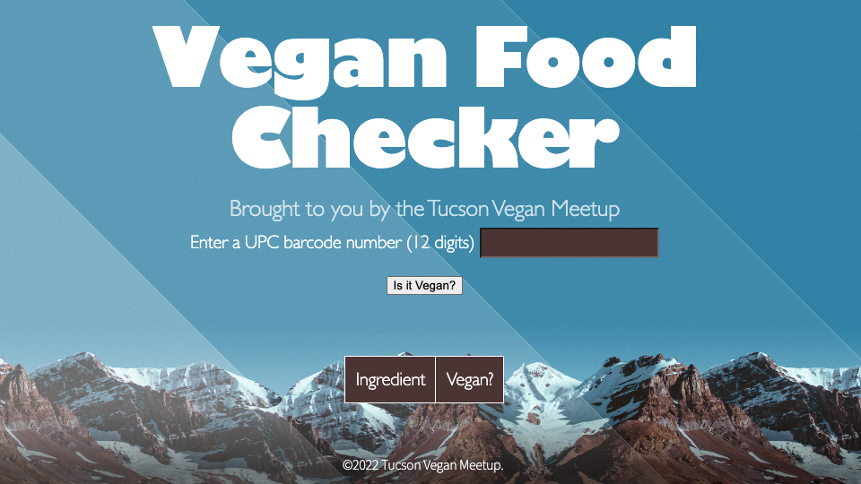

# "Is It Vegan?" Webs
Web application that checks if a food product is classified as vegan.

**Link to project:** https://vegan-checker-tvm.netlify.app/

## How It's Made:

**Tech used:** HTML, CSS, JavaScript, SASS

This web application was developed for a Vegan meetup group. The app takes in a UPC barcode number for a food product and returns an image of that item, the full ingredient list, and whether each ingredient is classified as vegan or not.

## Optimizations

Using the same API I can add in an option to show whether the item is classified as vegetarian as well as vegan. I would like to do this as well as add in multiple other dietary restrictions. Please feel free to contact me if you are aware of any API's that contain that sort of data!

